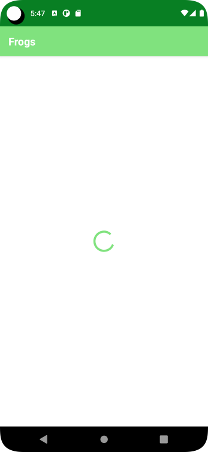
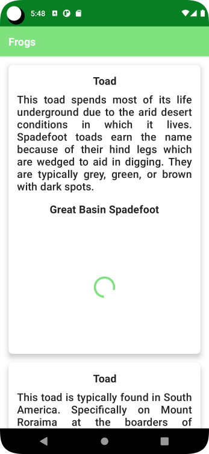
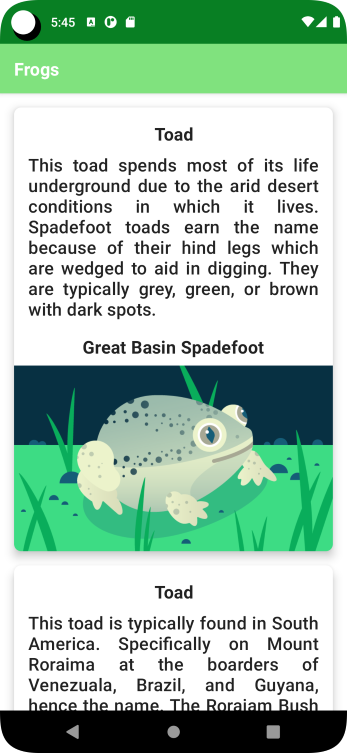
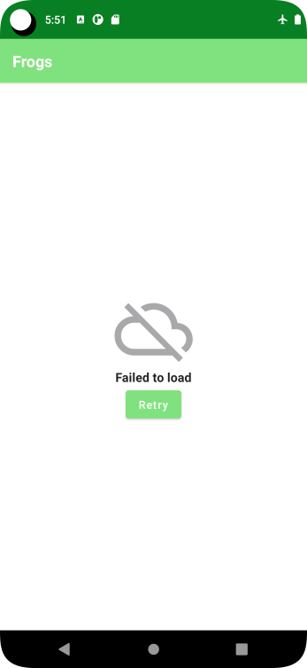
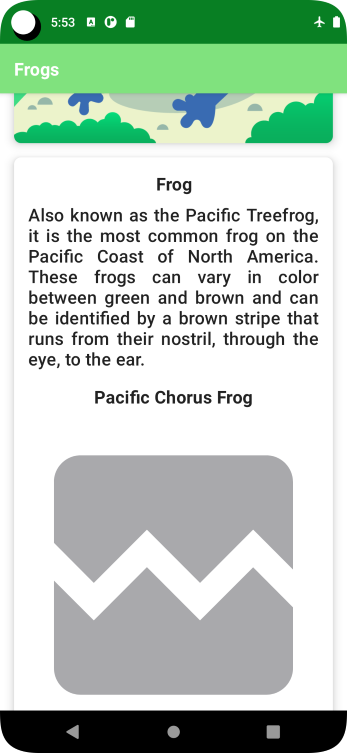

# Demo Internet Access App - Frogs App

Simple app to demonstrate internet access. 
The App displays a list of amphibians on the screen. 
A repository that connects to a RESTfull server to retrieve a list of amphibians in json format.
We also use a viewModel and uiState and Dependency Injection 

Some goals
- Use repository
- Use Dependency Injection Container
- use viewmodel
- use uiState

  
  
  

  
  

## Cheat Notes file
- [My Cheat Notes](CheatNotes.md)

ref: demo-internet-access-frogs-app-android-kotlin-compose
